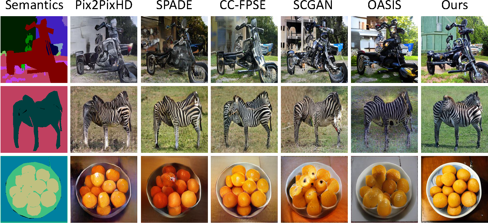

# Layout-to-image Defect Synthesis via Diffusion Models

&nbsp;

  


## Abstract

In recent years, 
huge progress has been made in image synthesis through the improvement of state-of-the-art generative models 
(e.g., VAEs, autoregressive models, and GANs). 
Now with the help of diffusion models, 
it reaches a brand-new level. 
However, applying diffusion models on conditional image synthesis still faces limitations and requires further investigations, especially for coarse spatial layouts, 
i.e., generating realistic images with the corrected objects in the desired locations.

In this master thesis, 
we introduced a style-based layout-to-image conditional diffusion model (STAY diffusion). 
To process the layout information, 
we extended the object instance-specific and layout-aware feature normalization (ISLA-Norm) used in LostGAN and adapted it for the proposed diffusion model framework. 
By training the novel model on the COCO-Stuff dataset, 
our method achieved state-of-the-art performance on image fidelity and diversity compared to other layout-to-image models. 
In addition, 
we trained the proposed model on the surface defect inspection (SDI) dataset from Robert Bosch to generate defective product surfaces while maintaining both high diversity and image quality, 
which can be used for data augmentation and further industrial purposes.


## Example Results

* **COCO-Stuff:**

<p align='center'>  
  
</p>

* **Surface Defect Inspection(SDI) dataset:**

<p align='center'>  
  
</p>

## Prerequisites
- Linux
- Python 3
- CPU or NVIDIA GPU + CUDA CuDNN

## Dataset Preparation
The Coco-stuff dataset can be downloaded and prepared following [COCO-stuff](https://github.com/nightrome/cocostuff.git)

The Surface Defect Inspection(SDI) dataset is a real industrial dataset(private) that consists of 20,414 greyscale images at various sizes.
To adapt the SDI dataset for the layout-to-image synthesis task, we did data labeling for acquiring the layout information. 
To annotate the images and customize the labeled bounding boxes, we used the software tool called Visual Object Tagging Toolkit ([VOTT])(https://github.com/microsoft/VoTT.git) which was developed by Microsoft.

### NEGCUT Training and Test

- Download the dataset.

- Train the SDM model:
```bash
export OPENAI_LOGDIR='OUTPUT/ADE20K-SDM-256CH'
mpiexec -n 8 python image_train.py --data_dir ./data/ade20k --dataset_mode ade20k --lr 1e-4 --batch_size 4 --attention_resolutions 32,16,8 --diffusion_steps 1000 \
                                   --image_size 256 --learn_sigma True --noise_schedule linear --num_channels 256 --num_head_channels 64 --num_res_blocks 2  \
                                   --resblock_updown True --use_fp16 True --use_scale_shift_norm True --use_checkpoint True --num_classes 151 \
	                           --class_cond True --no_instance True
```

- Fine-tune the SDM model:
```bash
export OPENAI_LOGDIR='OUTPUT/ADE20K-SDM-256CH-FINETUNE'
mpiexec -n 8 python image_train.py --data_dir ./data/ade20k --dataset_mode ade20k --lr 2e-5 --batch_size 4 --attention_resolutions 32,16,8 --diffusion_steps 1000 \
                                   --image_size 256 --learn_sigma True --noise_schedule linear --num_channels 256 --num_head_channels 64 --num_res_blocks 2 \
                                   --resblock_updown True --use_fp16 True --use_scale_shift_norm True --use_checkpoint True --num_classes 151 --class_cond True \
                                   --no_instance True --drop_rate 0.2 --resume_checkpoint OUTPUT/ADE20K-SDM-256CH/model.pt
```

- Test the SDM model:
```bash
mpiexec -n 8 python image_sample.py --data_dir ./data/ade20k --dataset_mode ade20k --attention_resolutions 32,16,8 --diffusion_steps 1000 \
                                    --image_size 256 --learn_sigma True --noise_schedule linear --num_channels 256 --num_head_channels 64 \ 
                                    --num_res_blocks 2 --resblock_updown True --use_fp16 True --use_scale_shift_norm True --num_classes 151 \
                                    --class_cond True --no_instance True --batch_size 2 --num_samples 2000 --s 1.5 \
                                    --model_path OUTPUT/ADE20K-SDM-256CH-FINETUNE/ema_0.9999_best.pt --results_path RESULTS/ADE20K-SDM-256CH
```

Please refer to the 'scripts/ade20.sh' for more details.

### Apply a pre-trained NEGCUT model and evaluate

#### Pretrained Models (to be updated)
|Dataset       |Download link     |
|:-------------|:-----------------|
|Cityscapes|[Visual results](https://drive.google.com/file/d/1TbLGCFJqRI4E8pFZJoHmj8MgDbwtjzhP/view?usp=sharing)|
|ADE20K|[Checkpoint](https://drive.google.com/file/d/1O8Avsvfc8rP9LIt5tkJxowMTpi1nYiik/view?usp=sharing) \| [Visual results](https://drive.google.com/file/d/1NIXmrlBHqgyMHAoLBlmU8YELmL8Ij4kV/view?usp=sharing)|
|CelebAMask-HQ |[Checkpoint](https://drive.google.com/file/d/1iwpruJ5HMHdAA1tuNR8dHkcjGtxzSFV_/view?usp=sharing) \| [Visual results](https://drive.google.com/file/d/1NDfU905iJINu4raoj4JdMOiHP8rTXr_M/view?usp=sharing)|
|COCO-Stuff |[Checkpoint](https://drive.google.com/file/d/17XhegAk8V5W3YiFpHMBUn0LED-n7B44Y/view?usp=sharing) \| [Visual results](https://drive.google.com/file/d/1ZluvN9spJF8jlXlSQ98ekWTmHrzwYCqo/view?usp=sharing)|

- To evaluate the model (e.g., ADE20K), first generate the test results:
```bash
mpiexec -n 8 python image_sample.py --data_dir ./data/ade20k --dataset_mode ade20k --attention_resolutions 32,16,8 --diffusion_steps 1000 \
                                    --image_size 256 --learn_sigma True --noise_schedule linear --num_channels 256 --num_head_channels 64 \ 
                                    --num_res_blocks 2 --resblock_updown True --use_fp16 True --use_scale_shift_norm True --num_classes 151 \
                                    --class_cond True --no_instance True --batch_size 2 --num_samples 2000 --s 1.5 \
                                    --model_path OUTPUT/ADE20K-SDM-256CH-FINETUNE/ema_0.9999_best.pt --results_path RESULTS/ADE20K-SDM-256CH
```

- To calucate FID metric, you should update "path1" and "path2" in "evaluations/test_with_FID.py" and run:
```bash
python evaluations/test_with_FID.py
```

- To calcuate LPIPS, you should evaluate the model for 10 times and run:
```bash
python evaluations/lpips.py GENERATED_IMAGES_DIR
```

### Acknowledge
Our code is developed based on [guided-diffusion](https://github.com/openai/guided-diffusion). We also thank "test_with_FID.py" in [OASIS](https://github.com/boschresearch/OASIS) for FID computation, "lpips.py" in [stargan-v2](https://github.com/clovaai/stargan-v2) for LPIPS computation.
